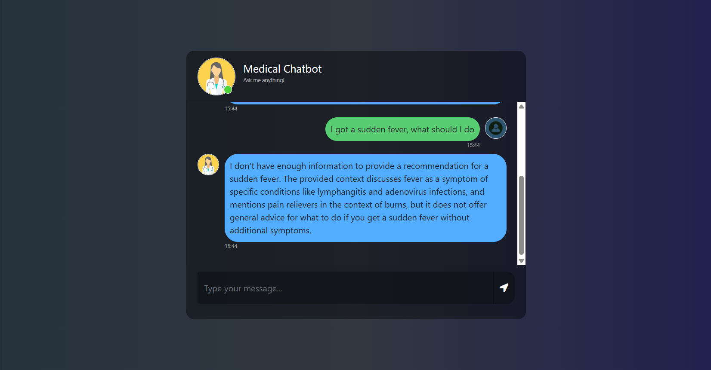

# Medical Chatbot (RAG over Medical PDFs)

A Retrieval-Augmented Generation (RAG) medical chatbot built with Flask, LangChain, Pinecone, and Google Gemini.  
It indexes medical PDF documents into a vector database and answers questions by retrieving relevant passages and generating concise, medically oriented responses.

> **Disclaimer**: This project is for educational purposes only and **does not provide professional medical advice**. Always consult a qualified healthcare professional for medical decisions.

---

## Demo

## Features

- **PDF ingestion** from the `data/` folder using LangChain loaders.
- **Text chunking** with `RecursiveCharacterTextSplitter`.
- **Dense embeddings** via `sentence-transformers/all-MiniLM-L6-v2` (HuggingFace).
- **Vector search** with Pinecone serverless index.
- **RAG pipeline** using LangChain:
  - Retriever over Pinecone documents.
  - Answer generation with Google Gemini (`gemini-2.5-flash`).
  - System prompt tuned for short, precise medical answers.
- **Web UI** served by Flask (`app.py`) with chat-style interaction.

---

## Project Structure

- `app.py` – Flask app, RAG chain wiring, and chat endpoint.
- `store_index.py` – One-time (or occasional) script to:
  - Load PDFs from `data/`
  - Clean and chunk text
  - Create / update the Pinecone index with embeddings
- `src/helper.py` – Helper utilities:
  - `load_pdf_files` – Load all PDFs from a directory.
  - `filter_to_minimal_docs` – Strip metadata to only include source.
  - `text_split` – Split documents into overlapping chunks.
  - `download_embeddings` – Configure HuggingFace embeddings model.
- `src/prompt.py` – System prompt for the medical assistant.
- `research/trials.ipynb` – Notebook for experimentation (e.g., alternative RAG chains).
- `data/` – Folder for your medical PDFs (e.g., `Medical_book.pdf`).
- `templates/` – HTML templates (e.g., `index.html` for the chat UI).
- `static/style.css` – Styling for the web UI.
- `pyproject.toml` / `uv.lock` – Dependency and environment management with `uv`.

---

## Requirements

- Python **3.12+**
- [Pinecone](https://www.pinecone.io/) account and API key
- [Google AI Studio](https://aistudio.google.com/) API key for Gemini
- (Optional) OpenAI API key if you experiment with OpenAI models in notebooks
- `uv` (recommended) or `pip` for dependency management

---

## Installation

1. **Clone the repository**

   git clone <your-repo-url>
   cd Medical_Chatbot
   