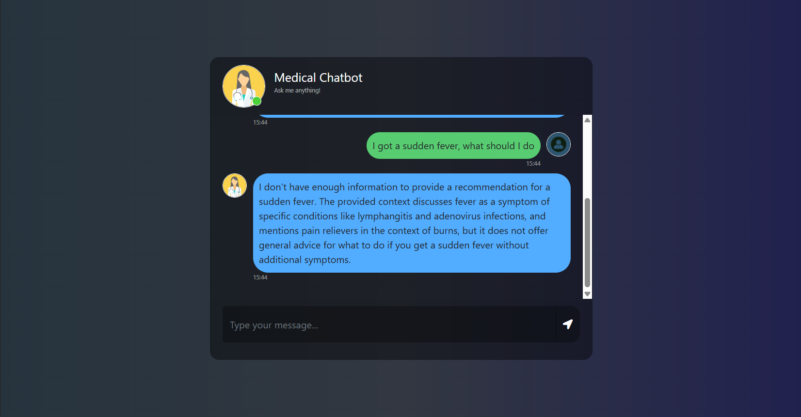

# Medical Chatbot (RAG over Medical PDFs)

A Retrieval-Augmented Generation (RAG) medical chatbot built with Flask, LangChain, Pinecone, and Google Gemini. It indexes medical PDF documents into a vector database and answers questions by retrieving relevant passages and generating concise, medically oriented responses.

> **Disclaimer**: This project is for educational purposes only and **does not provide professional medical advice**. Always consult a qualified healthcare professional for medical decisions.

---

## Demo


---

## Features

- **PDF ingestion** from the `data/` folder using LangChain loaders.
- **Text chunking** with `RecursiveCharacterTextSplitter` (chunk size: 500, overlap: 50).
- **Dense embeddings** via `sentence-transformers/all-MiniLM-L6-v2` (HuggingFace, 384 dimensions).
- **Vector search** with Pinecone serverless index (cosine similarity, k=3 retrievals).
- **RAG pipeline** using LangChain:
  - Retriever over Pinecone documents.
  - Answer generation with Google Gemini (`gemini-2.5-flash`).
  - System prompt tuned for short, precise medical answers (max 3 sentences).
- **Web UI** served by Flask (`app.py`) with chat-style interaction on `http://localhost:8000`.

---

## Project Structure

- `app.py` – Flask app, RAG chain wiring, and chat endpoint.
- `store_index.py` – One-time (or occasional) script to:
  - Load PDFs from `data/`
  - Clean and chunk text
  - Create / update the Pinecone index with embeddings
- `src/helper.py` – Helper utilities:
  - `load_pdf_files` – Load all PDFs from a directory using PyPDFLoader.
  - `filter_to_minimal_docs` – Strip metadata to only include source.
  - `text_split` – Split documents into overlapping chunks (500 chars, 50 overlap).
  - `download_embeddings` – Configure HuggingFace embeddings model.
- `src/prompt.py` – System prompt for the medical assistant (limits to 3 sentences).
- `research/trials.ipynb` – Notebook for experimentation (e.g., alternative RAG chains).
- `data/` – Folder for your medical PDFs (e.g., `Medical_book.pdf`).
- `templates/` – HTML templates (e.g., `index.html` for the chat UI).
- `static/style.css` – Styling for the web UI.
- `pyproject.toml` / `uv.lock` – Dependency and environment management with `uv`.

---

## Requirements

- Python **3.12+**
- [Pinecone](https://www.pinecone.io/) account and API key
- [Google AI Studio](https://aistudio.google.com/) API key for Gemini
- (Optional) OpenAI API key if you experiment with OpenAI models in notebooks
- `uv` (recommended) or `pip` for dependency management

### Dependencies

The project uses the following key libraries (from `pyproject.toml`):

- `flask>=3.1.3` – Web framework
- `langchain>=1.2.10` – RAG framework
- `langchain-google-genai>=4.2.1` – Gemini integration
- `langchain-pinecone>=0.2.13` – Pinecone vector store
- `sentence-transformers>=5.2.3` – Embeddings
- `pypdf>=6.7.4` – PDF loading
- `python-dotenv>=1.2.2` – Environment variables

---

## Setup Instructions

1. **Clone or download the repository** to your local machine.

2. **Install Python 3.12+** if not already installed.

3. **Install `uv`** (recommended for dependency management):
   ```
   pip install uv
   ```

4. **Create a virtual environment and install dependencies**:
   ```
   uv venv
   uv pip install -e .
   ```

   Alternatively, with `pip`:
   ```
   python -m venv .venv
   .venv\Scripts\activate  # On Windows
   pip install -e .
   ```

5. **Set up environment variables**:
   - Create a `.env` file in the root directory.
   - Add your API keys:
     ```
     PINECONE_API_KEY=your_pinecone_api_key_here
     GEMINI_API_KEY=your_google_gemini_api_key_here
     ```
   - Get Pinecone API key from [Pinecone Console](https://app.pinecone.io/).
   - Get Gemini API key from [Google AI Studio](https://aistudio.google.com/).

6. **Add medical PDFs**:
   - Place your PDF files (e.g., medical textbooks, articles) in the `data/` folder.
   - Supported format: PDF only.

7. **Index the documents**:
   - Run the indexing script to create the Pinecone vector index:
     ```
     python store_index.py
     ```
   - This will load PDFs, chunk text, generate embeddings, and store in Pinecone index named "my-medical-chatbot".

8. **Run the application**:
   ```
   python app.py
   ```
   - The app will start on `http://localhost:8000`.
   - Open your browser and navigate to the URL for the chat interface.

---

## Usage

- **Chat Interface**: Type medical questions in the web UI. The bot retrieves relevant passages from indexed PDFs and generates answers using Gemini.
- **Re-indexing**: If you add new PDFs, re-run `store_index.py` to update the index.
- **Experimentation**: Use `research/trials.ipynb` for testing different models or configurations.

---

## Troubleshooting

- **API Key Issues**: Ensure `.env` file is in the root and keys are correct. Restart the app after changes.
- **Pinecone Index**: If index creation fails, check your Pinecone account limits and region settings.
- **PDF Loading**: Ensure PDFs are not password-protected and are text-based (not image-only).
- **Port Conflict**: If port 8000 is busy, modify `app.py` to use a different port.
- **Embeddings Download**: First run may take time to download the sentence-transformers model.

---

## Contributing

Feel free to fork and contribute. For major changes, please open an issue first.

---

## License

See `LICENSE` file for details.

   